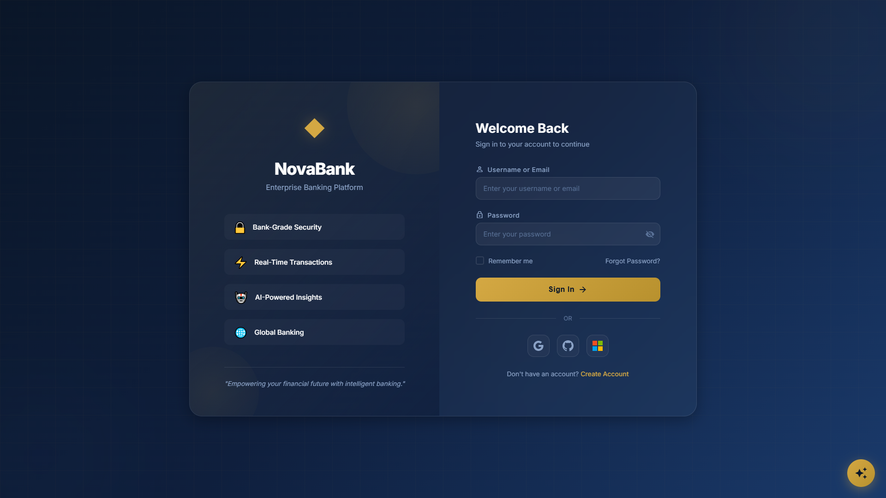
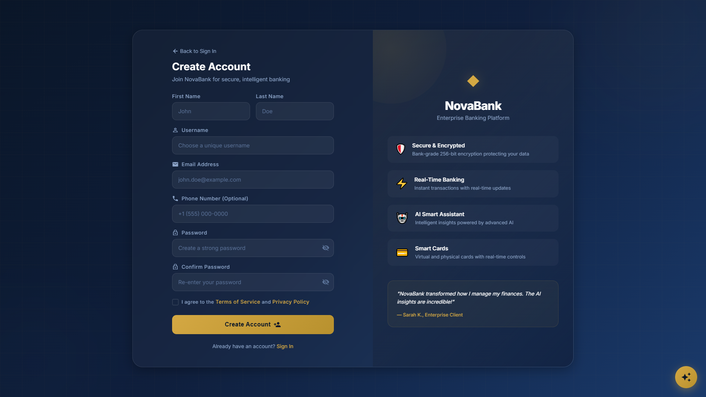
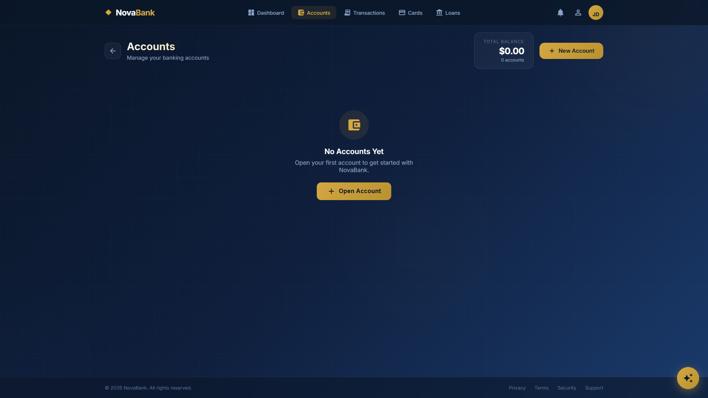
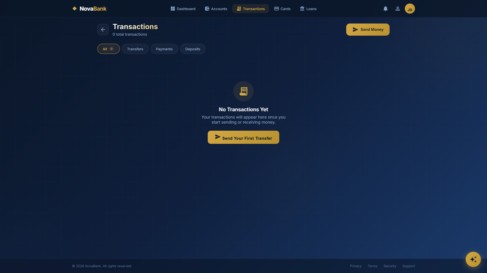
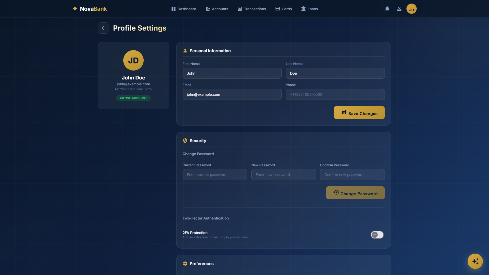
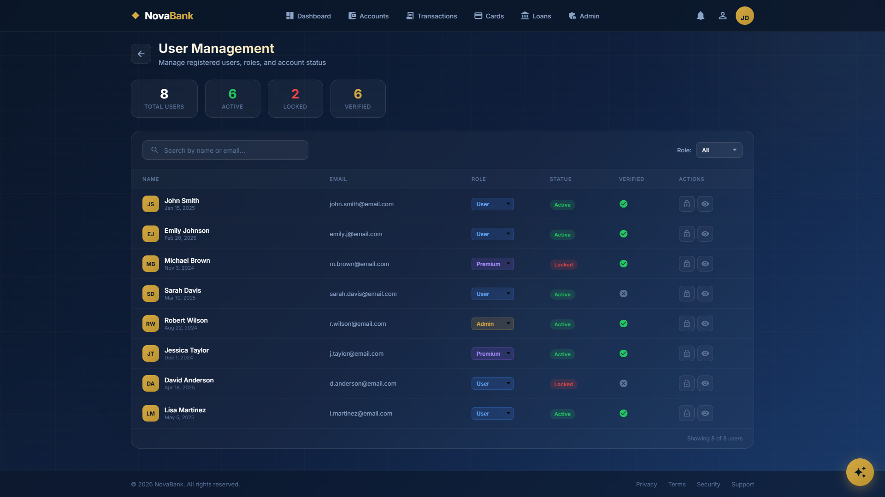

# NovaBank - Enterprise AI-Powered Banking Platform

<div align="center">

[](https://adoptium.net/)
[](https://spring.io/projects/spring-boot)
[](https://angular.dev/)
[](https://docs.langchain4j.dev/)
[](https://www.postgresql.org/)
[](https://www.docker.com/)
[](LICENSE)

**Next-Generation Banking Platform** — Microservices, LangChain4j AI Agents, RAG, ChromaDB Vector Store, Credit Cards, Real-Time Processing, and Multi-Role Admin Dashboard.

</div>

---

## Demo Credentials

| Role | Username | Password | Access |
|------|----------|----------|--------|
| **Admin** | `admin` | `Admin@123` | Full system & user management, card admin, AI agent monitor |
| **User** | `demo` | `Demo@123` | Accounts, transactions, cards, loans, AI chat |

> These accounts are auto-seeded when the auth-service starts. No manual setup required.

---

## System Architecture

```
┌──────────────────────────────────────────────────────────────────────────┐
│                          ANGULAR 19 UI (:4200)                           │
│  Login │ Dashboard │ Accounts │ Transactions │ Cards │ Loans │ AI Chat  │
│  Admin Dashboard │ Admin Users │ Admin Cards │ Agent Monitor │ Settings │
├──────────────────────────────────────────────────────────────────────────┤
│                   API GATEWAY — Spring Cloud Gateway (:8080)              │
│             Rate Limiting (Redis) │ JWT Validation │ CORS                 │
├──────┬──────┬──────┬──────┬──────┬──────┬──────┬──────┬──────────────────┤
│ Auth │ Acct │ Trans│ Card │Agent │Notif │Admin │ Loan │   MICROSERVICES  │
│:8081 │:8083 │:8085 │:8089 │:8095 │:8087 │  MS  │  MS  │   (Java 21)      │
├──────┴──────┴──────┴──────┴──────┴──────┴──────┴──────┴──────────────────┤
│ PostgreSQL 16    │ MongoDB 7    │ Redis 7    │ ChromaDB (Vector Store)   │
├──────────────────────────────────────────────────────────────────────────┤
│ Kafka (Event Stream) │ Ollama (Llama 3.2 + nomic-embed-text)             │
│ LangChain4j Agents  │ RAG Pipeline │ MCP Tool Protocol                   │
├──────────────────────────────────────────────────────────────────────────┤
│ Docker Compose │ GitHub Actions │ 16 Screenshots                         │
└──────────────────────────────────────────────────────────────────────────┘
```

## Features

### User Features
- **Multi-Factor Authentication** — JWT-based auth with refresh tokens, account lockout protection
- **Account Management** — Checking, Savings, Business, Investment, Fixed Deposit accounts
- **Real-Time Transactions** — Instant transfers with Kafka event streaming + SSE push updates
- **Credit Card Services** — Virtual cards (Visa, Mastercard, AMEX, RuPay), apply, activate, freeze, payments, statements, disputes, rewards
- **Loan Management** — Personal, Home, Auto, Education, Business loans with EMI calculator
- **AI-Powered Assistant** — Conversational AI with RAG knowledge base + Agent mode with tool execution
- **Financial Insights** — AI-generated personalized financial recommendations
- **Real-Time Notifications** — SSE-based instant push notifications for all banking events
- **Profile Management** — Personal info, security settings, notification preferences

### Admin Features
- **Admin Dashboard** — System overview, real-time stats, activity feed, quick actions
- **User Management** — View all users, manage roles (admin/user/manager/auditor), toggle account status
- **Card Administration** — View all cards, approve/reject applications, manage credit limits
- **Transaction Monitoring** — View all transactions, flag suspicious activity
- **AI Agent Monitor** — View conversations, track agent actions, manage knowledge base documents
- **System Settings** — Configure security policies, notification rules, AI parameters

### AI & Intelligence
- **LangChain4j Agentic AI** — Java-based AI agents with tool-calling capabilities, running locally via Ollama
- **Retrieval-Augmented Generation (RAG)** — Banking knowledge base stored as vector embeddings in ChromaDB
- **Ollama Integration** — Local LLM inference (Llama 3.2, nomic-embed-text) — complete data privacy
- **MCP (Model Context Protocol)** — Standardized tool interface for AI models with 11 banking tools
- **5 Agent Personas** — General, Financial Advisor, Fraud Analyst, Loan Officer, Card Specialist
- **Automated Banking Tools** — Account balance, transaction history, card info, spending analysis, fraud detection, loan eligibility
- **ChromaDB Vector Store** — Persistent, scalable vector database for RAG with document upload/management

---

## Tech Stack

<details open>
<summary><b>Backend</b></summary>

| Service | Technology | Database | Port |
|---------|-----------|----------|------|
| API Gateway | Spring Cloud Gateway 4.2, Redis | — | 8080 |
| Auth Service | Spring Boot 3.4.5, Spring Security, JWT (HMAC-SHA256) | PostgreSQL | 8081 |
| Account Service | Spring Boot 3.4.5, Spring Data MongoDB | MongoDB | 8083 |
| Transaction Service | Spring Boot 3.4.5, Kafka Streams | PostgreSQL | 8085 |
| Notification Service | Spring Boot 3.4.5, SSE, Kafka | PostgreSQL | 8087 |
| Card Service | Spring Boot 3.4.5, Luhn Validation | PostgreSQL | 8089 |
| Agent Service | LangChain4j 1.0, Ollama, ChromaDB | PostgreSQL | 8095 |

</details>

<details open>
<summary><b>Frontend</b></summary>

| Layer | Technology |
|-------|-----------|
| Framework | Angular 19 (NgModule, non-standalone) |
| UI Components | Angular Material 19 |
| State Management | RxJS Subjects + Services |
| Auth | JWT Interceptor, Auth Guard, Refresh Token Rotation |
| Real-Time | Server-Sent Events (EventSource) |
| AI Integration | RAG + Agent Mode toggle, tool visualization |
| Styling | Dark Navy/Gold Theme with CSS Variables |
| Build | 1.01 MB initial, ~270 KB lazy-loaded admin module |

</details>

<details open>
<summary><b>Infrastructure</b></summary>

| Component | Technology |
|-----------|-----------|
| Containerization | Docker + Docker Compose |
| CI/CD | GitHub Actions |
| Databases | PostgreSQL 16, MongoDB 7, Redis 7 |
| Vector DB | ChromaDB (persistent, dockerized) |
| Message Broker | Apache Kafka + Zookeeper |
| AI Runtime | Ollama (local LLM inference) |
| Monitoring | Redis Commander, Mongo Express, Kafka UI |

</details>

---

## Project Structure

```
ai-banking-platform/
├── backend/                              # Java 21 + Spring Boot 3.4
│   ├── pom.xml                           # Parent POM (multi-module Maven)
│   ├── auth-service/                     # Authentication & Authorization
│   ├── account-service/                  # Account Management (MongoDB)
│   ├── transaction-service/              # Transaction Processing (Kafka)
│   ├── notification-service/             # SSE Notifications
│   ├── card-service/                     # Credit Card Lifecycle (NEW)
│   ├── agent-service/                    # LangChain4j AI Agents (NEW)
│   └── api-gateway/                      # Spring Cloud Gateway
│
├── frontend/                             # Angular 19 Web App
│   ├── Dockerfile                        # Production build (nginx)
│   ├── nginx.conf                        # Reverse proxy config
│   ├── proxy.conf.json                   # Dev proxy to gateway
│   └── src/app/
│       ├── core/                         # Auth, guards, interceptors, services
│       ├── auth/                         # Login & Register
│       ├── dashboard/                    # User dashboard
│       ├── accounts/                     # Account management
│       ├── transactions/                 # Transaction history
│       ├── cards/                        # Virtual cards (NEW)
│       ├── loans/                        # Loan management (NEW)
│       ├── profile/                      # User profile (NEW)
│       ├── admin/                        # Full admin panel (NEW)
│       ├── ai/                           # AI chat + agent mode (ENHANCED)
│       └── notifications/               # Notification center
│
├── ai/                                   # Legacy Python AI service
│   └── ai-service/                       # FastAPI (replaced by agent-service)
│
├── docker/
│   └── postgres/init/01-init.sql         # DB initialization
│
├── docker-compose.yml                    # Full stack orchestration
├── .env.example                          # Environment template
└── README.md
```

---

## Quick Start

### Prerequisites

```bash
# Install these tools first:
#   - Java 21+    → java -version
#   - Maven 3.9+  → mvn -version
#   - Node.js 22+ → node --version
#   - Docker      → docker --version
#   - Ollama      → ollama list

# Download required AI models
ollama pull llama3.2
ollama pull nomic-embed-text
```

### Option A: One-Click Docker Setup (Recommended)

```bash
# Clone, build, and run everything with one command
git clone https://github.com/Anilg1997/ai-banking-platform.git
cd ai-banking-platform
docker-compose up --build
```

This starts all 15+ services:
- Angular frontend (nginx) on **http://localhost:4200**
- API Gateway on **http://localhost:8080**
- All 6 microservices (auth, account, transaction, notification, card, agent)
- PostgreSQL, MongoDB, Redis, ChromaDB, Kafka
- Monitoring UIs (Redis Commander, Mongo Express, Kafka UI)

### Option B: Local Development

```bash
# 1. Start infrastructure via Docker
docker-compose up -d postgres redis mongodb chromadb kafka

# 2. Build all backend services
cd backend
mvn clean install -DskipTests

# 3. Start microservices (in separate terminals)
mvn spring-boot:run -pl auth-service
mvn spring-boot:run -pl account-service
mvn spring-boot:run -pl transaction-service
mvn spring-boot:run -pl notification-service
mvn spring-boot:run -pl card-service
mvn spring-boot:run -pl agent-service
mvn spring-boot:run -pl api-gateway

# 4. Start frontend
cd frontend
npm install
ng serve -o
```

### Login

Open **http://localhost:4200** and sign in with:
- **Admin:** `admin` / `Admin@123`
- **User:** `demo` / `Demo@123`

---

## API Endpoints

### Auth & Admin (`POST /api/auth`, `GET /api/admin`)

| Method | Endpoint | Description |
|--------|----------|-------------|
| POST | `/api/auth/register` | Register new user |
| POST | `/api/auth/login` | User login (returns JWT) |
| POST | `/api/auth/refresh` | Rotate refresh token |
| POST | `/api/auth/logout` | Invalidate session |
| GET | `/api/auth/me` | Current user profile |
| GET | `/api/admin/users` | List all users (admin) |
| PATCH | `/api/admin/users/{id}/role` | Update user role (admin) |
| PATCH | `/api/admin/users/{id}/status` | Lock/unlock user (admin) |

### Card Service (`/api/cards`)

| Method | Endpoint | Description |
|--------|----------|-------------|
| POST | `/api/cards/apply` | Apply for credit card |
| GET | `/api/cards/my-cards` | List user's virtual cards |
| GET | `/api/cards/{id}` | Card details with design |
| POST | `/api/cards/{id}/activate` | Activate card |
| POST | `/api/cards/{id}/freeze` | Freeze/unfreeze card |
| POST | `/api/cards/{id}/make-payment` | Pay credit card bill |
| GET | `/api/cards/{id}/statement` | Latest statement |
| GET | `/api/cards/{id}/transactions` | Card transactions |
| POST | `/api/cards/transactions/{id}/dispute` | Dispute transaction |
| GET | `/api/cards/rewards/summary` | Reward points summary |

### Agent Service (`/api/agent`)

| Method | Endpoint | Description |
|--------|----------|-------------|
| POST | `/api/agent/chat` | Chat with AI agent |
| POST | `/api/agent/analyze` | Analyze financial data |
| GET | `/api/agent/tools` | List available MCP tools |
| GET | `/api/agent/conversations` | User conversation history |
| GET | `/api/admin/agent/conversations` | All conversations (admin) |
| GET | `/api/admin/agent/stats` | Agent usage statistics |
| POST | `/api/admin/agent/knowledge/upload` | Upload document to RAG |
| GET | `/api/admin/agent/knowledge/documents` | List KB documents |

---

## AI & Agent System

### Architecture

```
User Message → Agent Service → LangChain4j → Ollama (Llama 3.2)
                                    │
                    ┌───────────────┼───────────────┐
                    ▼               ▼               ▼
              ChromaDB RAG    MCP Tool Layer    Conversation
              (Knowledge Base) (11 Banking      History (DB)
                              Tools)
                    │               │
                    └───────────────┘
                          ▼
                  Natural Language Response
```

### How It Works

1. **LangChain4j + Ollama**: The agent-service uses LangChain4j (Java AI framework) with Ollama (Llama 3.2) for LLM inference. All data stays local — no external API calls, complete data privacy.

2. **RAG with ChromaDB**: Banking knowledge base (FAQs, policies, procedures) is stored as vector embeddings in ChromaDB. When a user asks a question, semantic search retrieves relevant documents as context for the LLM.

3. **MCP Tools (Model Context Protocol)**: 11 standardized banking tools:
   - `getAccountBalance` — Real-time balance for any account
   - `listAccounts` — All user accounts with types
   - `getRecentTransactions` — Last N transactions
   - `getAccountTransactions` — Transactions by account
   - `getSpendingStats` — Categorized spending analysis
   - `getCardInfo` — Card details and status
   - `getCardTransactions` — Card-specific transactions
   - `getAvailableCredit` — Credit utilization
   - `getRewardsSummary` — Reward points balance
   - `getFraudAlerts` — Flagged transactions
   - `checkLoanEligibility` — Loan qualification check

4. **Agent Personas**: 5 specialized types selectable in the chat UI:
   - **GENERAL** — Helpful banking assistant for all queries
   - **FINANCIAL_ADVISOR** — Investment, savings, financial planning
   - **FRAUD_ANALYST** — Transaction monitoring, anomaly detection
   - **LOAN_OFFICER** — Loan processing, eligibility assessment
   - **CARD_SPECIALIST** — Credit card services, rewards optimization

5. **Frontend Experience**: Toggle between standard AI chat (with RAG) and Agent Mode (with live tool execution). Tool calls are visualized as interactive cards in the chat UI.

---

## Credit Card System

The card-service implements a complete credit card lifecycle:

| Feature | Description |
|---------|-------------|
| **Virtual Card Design** | Visa (gold), Mastercard (blue), AMEX (green), RuPay (orange) — dynamic CSS rendering |
| **Card Lifecycle** | Draft → Submitted → Under Review → Approved/Rejected → Activate → Active → Freeze/Lost/Cancelled |
| **Billing** | Monthly statement generation, minimum payment calculation, due dates, auto-pay |
| **Rewards** | 1 point per $100 spent (2x on travel/dining), automatic tracking and summary |
| **Security** | CVV validation, PIN management, fraud dispute, freeze/unfreeze, lost card reporting |
| **Payments** | One-time and auto-pay from linked checking/savings accounts |
| **Compliance** | Luhn algorithm card number validation, PCI data handling patterns |

---

## Screenshots

<div align="center">

### User Experience

| | | |
|:---:|:---:|:---:|
| **Login** | **Register** | **Dashboard** |
|  |  |  |
| **Accounts** | **Transactions** | **Cards** |
|  |  |  |
| **Card Apply** | **Loans** | **Notifications** |
|  |  |  |
| **Profile** | **AI Chat (RAG+Agent)** | |
|  |  | |

### Admin Dashboard

| | | |
|:---:|:---:|:---:|
| **Admin Dashboard** | **User Management** | **Card Admin** |
|  |  |  |
| **Agent Monitor** | **System Settings** | |
|  |  | |

</div>

---

## Monitoring & Management

| Tool | URL | Credentials |
|------|-----|-------------|
| **Angular App** | http://localhost:4200 | `admin` / `Admin@123` |
| **Redis Commander** | http://localhost:8082 | — |
| **Mongo Express** | http://localhost:8084 | `admin` / `admin123` |
| **Kafka UI** | http://localhost:8086 | — |
| **ChromaDB** | http://localhost:8000 | — |

---

## Development

### Frontend Development (Hot Reload)

```bash
cd frontend
ng serve --open
# App runs on localhost:4200 with live reload
# API calls proxy through to localhost:8080 (gateway)
```

### Adding New Microservices

```bash
# 1. Create service directory under backend/
mkdir backend/new-service

# 2. Create pom.xml with parent com.banking:banking-platform:1.0.0-SNAPSHOT
# 3. Add module to backend/pom.xml
# 4. Create Dockerfile following existing pattern
# 5. Add service to docker-compose.yml
# 6. Add routes to api-gateway application.yml
```

### Running Tests

```bash
# Backend
cd backend && mvn test

# Frontend
cd frontend && ng test
```

---

## Roadmap

- **Phase 1** — Foundation: Multi-module Maven, Auth + JWT, API Gateway, Angular 19 theme
- **Phase 2** — Core Banking: Accounts (MongoDB), Transactions (Kafka), SSE Notifications, Dashboard
- **Phase 3** — Cards & AI: Credit Card Service, LangChain4j Agents, ChromaDB RAG, Admin Dashboard, Agent Mode *(current)*
- **Phase 4** — Production: AWS deployment (ECS/RDS/ElastiCache), Prometheus/Grafana monitoring, load testing, security audit

---

## License

MIT License — see [LICENSE](LICENSE) file for details.

---

<div align="center">
Built with Java 21, Spring Boot 3.4, Angular 19, LangChain4j, and ❤️
</div>
